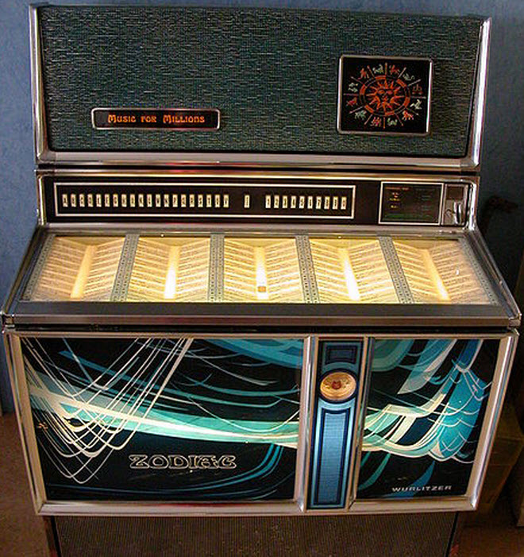
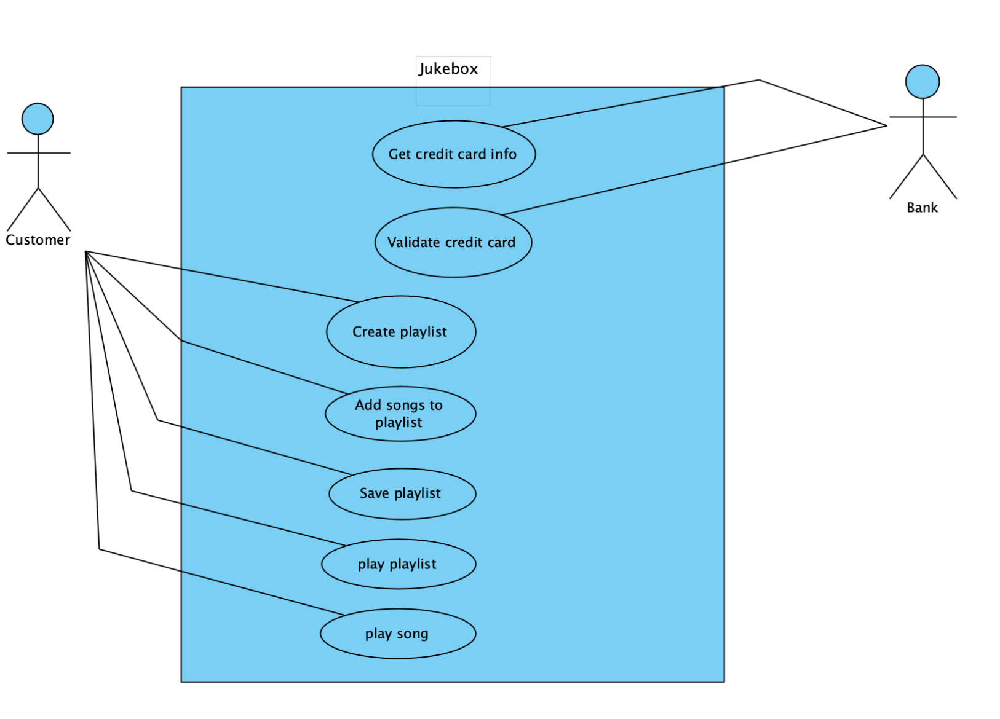
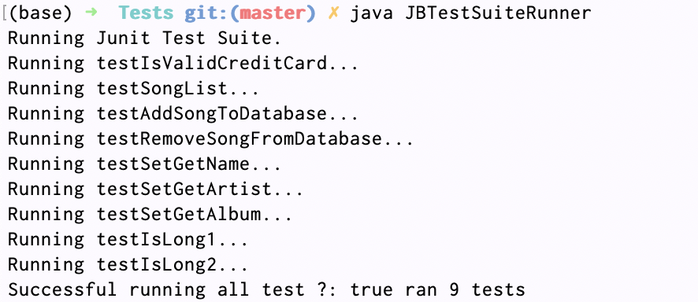

# Jukebox

<p align="center">
  
</p>

# Description
- Design a Juke Box that allows customers to select songs they want played or to submit a play list that they have already created previously. If a request is made for song that is not contained by a local Juke Box, it will query for that song from other Jukeboxes elsewhere in the country - thus they are networked. Although reminiscent of Napster, like the original jukebox, we want to provide a mechanism for owners, record companies and artists to earn a profit. Therefore, for this Juke Box we want to provide not only a coin drop and cash feed mechanism, but also a card swipe mechanism and a cell dial payment capability.


# Juke Box spec

Allow customers to
- select songs they want to play.
- submit a play list that they have already created previously.

The Juke Box can search other Juke Boxes from Internet for songs that are not contained by a local Juke Box.
To provide a mechanism for owners, record companies and artists to earn a profit. The Juke Box contains
- A coin drop
- Cash feed mechanism
- A card swipe mechanism
- A cell dial payment capability.

# Diagrams
<details>
   <summary>Use Case Diagram</summary>
   <p></p>
</details>
<details>
   <summary>Class Diagram</summary>
   <p></p>
</details>
<details>
   <summary>Sequence Diagram</summary>
   <p></p>
</details>

# UnitTests
- The unit tests are designed as the following simple diagram
```

+-----------------------+   +-----------------------+  +---------------------+
|  Database Module      |   |      Song Module      |  |    Jukebox Module   |
+-----------------------+   +-----------------------+  +---------------------+
+-----------------------+   +-----------------------+  +---------------------+
| Test Database Moduel  |   |    Test Song Module   |  | Test Jukebox Module |
+-----------------------+   +-----------------------+  +---------------------+
                            +----------------------+
                            |      Test Suite      |
                            +----------------------+
                            +----------------------+
                            |  Test Suite Runner   |
                            +----------------------+
```
- All the tests file can be found under [Tests](https://github.com/Quan25/Jukebox/tree/master/Tests) folder
- Sample running output after running the test
<p></p>
# How to Run
1. Add javazoom package the classpath
```
  export CLASSPATH=$CLASSPATH:path/to/Jukebox/JLayer1.0.1/jl1.0.1.jar
```
2. Run `javac *.java` on your root directory
3. Add the project to java CLASSPATH
```
  export CLASSPATH=$CLASSPATH:path/to/Jukebox/
```
4. Run `java Jukebox` to see the output
